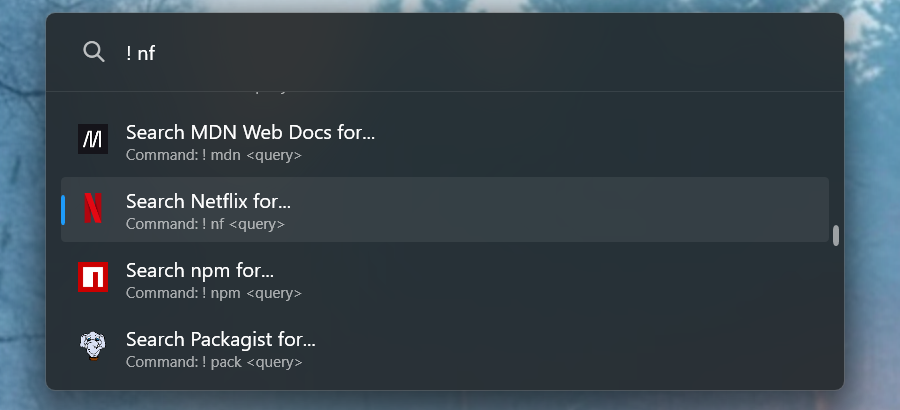
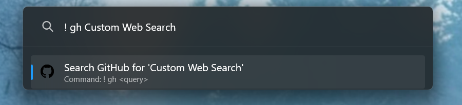

# Custom Web Search
Plugin for Microsoft PowerToys Run that allows you to search the internet.



## Usage
```
! <alias> <query>
```



The default trigger is an exclamation mark (`!`) but can be changed in the settings.

The plugin currently supports over 40 domains but with a focus towards programming related sites/docs. This includes domains such as Amazon, GitHub, IMDb, Reddit, and YouTube. The alias selection is primarily based on the DuckDuckGo [Bangs library](https://duckduckgo.com/bangs) but you are free to modify them in the `services.json` file. Make sure to restart PowerToys afterwards.

## Install instructions
* Exit PowerToys
* Download latest version from [releases](https://github.com/nilste/custom-web-search/releases)
* Extract zip
* Move extracted folder `CustomWebSearch` to `%LOCALAPPDATA%\Microsoft\PowerToys\PowerToys Run\Plugins\`
* Start PowerToys

## Build instructions
* Clone this repo
* Inside the `CustomWebSearch` folder, create another one called `libs`
* Copy the following files from `%LOCALAPPDATA%\PowerToys\` to `libs`
    * Wox.Plugin.dll
    * Wox.Infrastructure.dll
    * Microsoft.Data.Sqlite.dll
    * PowerToys.Settings.UI.Lib.dll
* Open the project in Visual Studio and build it in release mode
* Copy the output folder `net8.0-windows` to `%LOCALAPPDATA%\Microsoft\PowerToys\PowerToys Run\Plugins\`
* (Optional) Rename the copied folder to `CustomWebSearch`